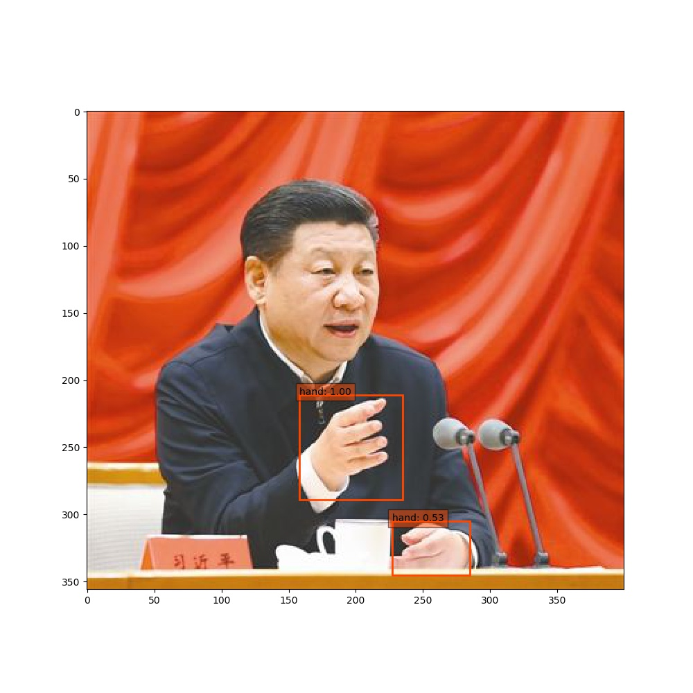

### [SSD-Hand-Detection](https://github.com/weiliu89/caffe/tree/ssd)
#### Dataset
* [egohands](http://vision.soic.indiana.edu/projects/egohands/)
* [stanfordhands](http://www.robots.ox.ac.uk/~vgg/data/hands/)

#### Preprocess
* `min(hands width and height) > threshold`, for egohands, `threshold=40`; for stanfordhands, `threshold=20`.
* clean dataset can be downloaded from [onedrive]().
* run `create_txt.py` to generate `test.txt` and `trainval.txt`.
* At last run `./create_data.sh` to generate lmdb file in data/lmdb folder.

#### Train
* pretrained model are provided by the author and trained on [PASCAL VOC 2012, 2017](http://host.robots.ox.ac.uk/pascal/VOC/). [Download Link]().

#### demo
